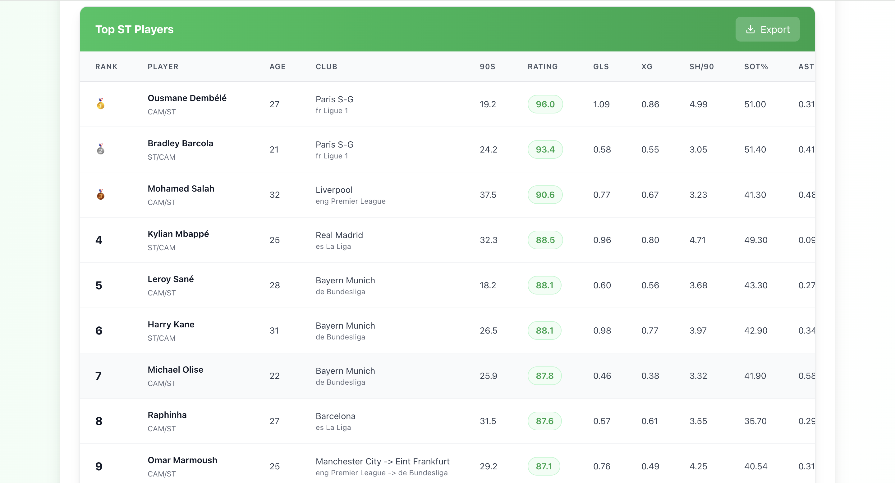
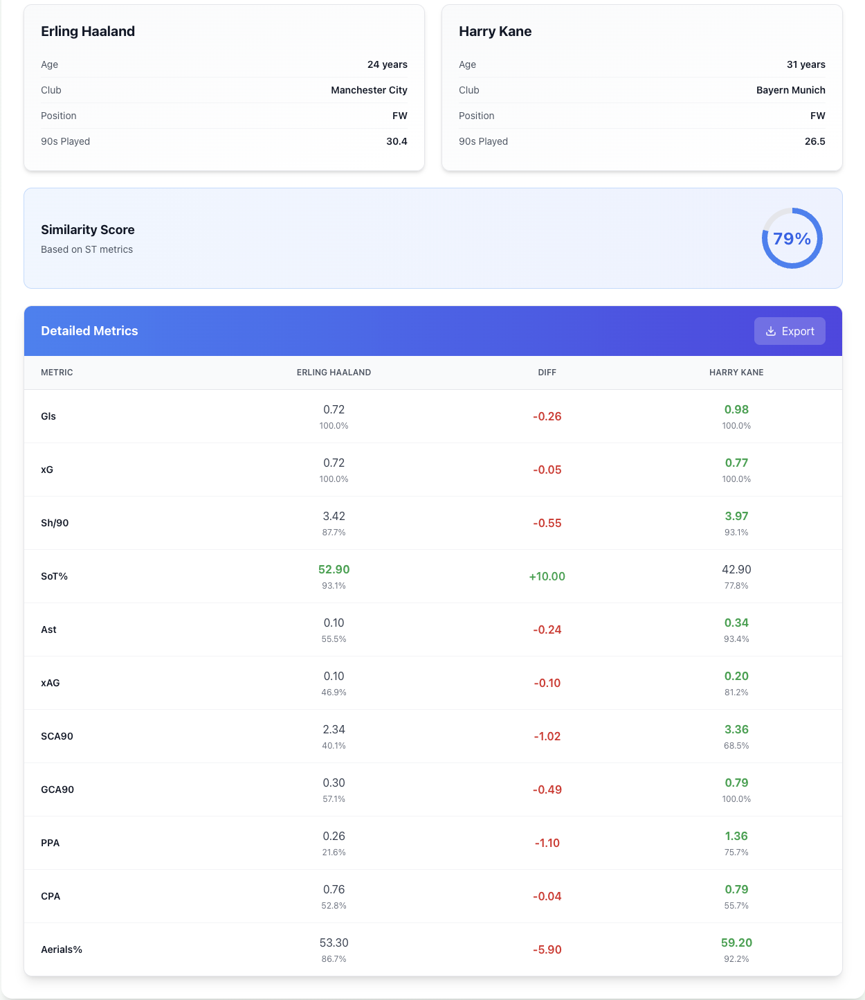
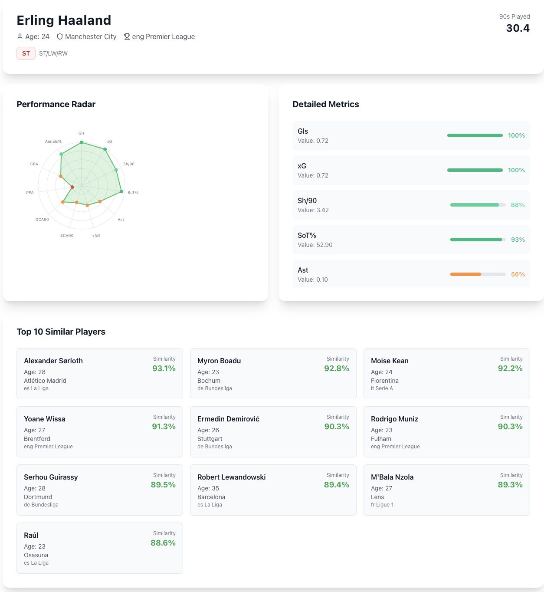
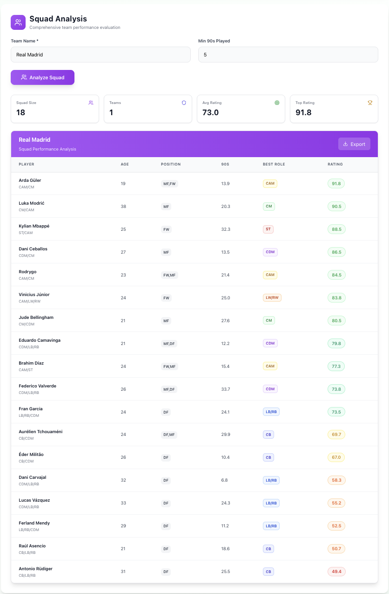

# ScoutCompare

**Advanced football player performance analysis and scouting tool built for the top 5 European leagues.**

ScoutCompare lets scouts, analysts, and fans rank players by position, run head-to-head comparisons, profile individual players with percentile-based radar charts, and assess entire squads — all through a clean, real-time web interface.

---

## Features

| Feature | Description |
|---|---|
| **Player Rankings** | Filter by position, age range, league, minimum 90s, and score range. Results are ranked with a weighted composite score. |
| **Head-to-Head Comparison** | Compare any two players across position-specific metrics, with a computed similarity percentage. |
| **Squad Analysis** | Enter a club name and get every player ranked by their best positional fit and overall score. |
| **Player Search & Profiles** | Search by name, click through to a full profile with an SVG radar chart, percentile bars, raw stat values, and a top-10 most similar players list. |
| **CSV Export** | Any result table can be exported to a clean, timestamped `.csv` file. |

---

## Architecture

The frontend is a single-page React app (Vite) that communicates with a Flask REST API over JSON. The API reads from a SQLite database of ~2,000+ outfield players scraped from FBref, using pandas for all data manipulation and NumPy for the scoring math.

In production, Flask serves the Vite build out of `dist/` directly — no separate web server or proxy needed. The full dataset is loaded once at startup and held in memory behind a thread-safe lock, so repeated queries don't hit disk.

---

## Tech Stack

| Layer | Technology |
|---|---|
| Frontend framework | React 18 (Vite) |
| Styling | Tailwind CSS |
| Icons | Lucide React |
| Backend | Python / Flask |
| Data layer | SQLite + pandas |
| CORS | flask-cors |
| Rate limiting | flask-limiter |
| Numerical computation | NumPy |

---

## Scoring System

ScoutCompare uses a **two-tier weighted percentile model** to score players.

### 1. Metric selection by position

Each of the 7 supported positions (LB/RB, CB, CDM, CM, CAM, LW/RW, ST) has a curated list of relevant metrics drawn from FBref's passing, shooting, possession, defensive, and creation datasets.

### 2. Percentile calculation

For each metric, a player's raw value is converted to a percentile rank against all players in the same broad positional category (DF / MF / FW) in the full dataset. To reduce the effect of extreme outliers, values are winsorized to the 5th–95th percentile range before the rank is computed.

### 3. Two-layer weighting

The final score is a weighted average of metric percentiles, with two multiplicative weight factors applied:

- **Role-category weight** — reflects how important a metric is for defenders, midfielders, or forwards in general (e.g. `Clr` is weighted higher for defenders).
- **Position-specific weight** — fine-grained multipliers per exact position (e.g. `CrsPA` is weighted 2.8× for fullbacks, 0.2× for centre-backs).

```
metric_score  = percentile(player_value, position_category)
weight        = role_weight[metric][category] × position_weight[position][metric]
overall_score = Σ(metric_score × weight) / Σ(weight)   ∈ [0, 100]
```

### 4. Multi-club consolidation

Players who appeared for more than one club in a season are consolidated into a single row. Counting stats (`Gls`, `Ast`, `MP`, `Min`, `90s`) are summed; rate stats (`Cmp%`, `xG`, `SCA90`, etc.) are averaged weighted by 90s played at each club.

---

## Key Design Decisions

**SQLite over a hosted DB** — The dataset is a static snapshot (one season), so SQLite is sufficient and removes all infrastructure overhead. The file is loaded once at startup and cached in memory via a thread-safe lock.

**Percentile-over-raw-values scoring** — Raw stats vary enormously by playing time. Percentile ranks normalize for this and make cross-league comparisons fair without manual per-league scaling.

**Winsorized percentiles** — Clipping at the 5th/95th before ranking prevents a single outlier (e.g. a goalkeeper's 0 for `Gls`) from distorting the entire distribution.

**Position-specific weight tables instead of ML** — Explicit weight tables keep the model interpretable and editable without retraining. A scout can open the config, see exactly why a player scored the way they did, and adjust weights if their scouting criteria differ.

**Flask serves the frontend** — Co-locating the API and static files in one process simplifies deployment to any single-server environment (e.g. a cheap VPS or Render free tier).

**Rate limiting at the route level** — `flask-limiter` caps expensive endpoints (20 req/min for ranking/comparison, 10 req/min for export) to prevent runaway scraping of the API.

---

## API Reference

All endpoints return JSON. Errors follow `{ "error": "..." }` with an appropriate HTTP status code.

### `POST /api/rank-players`
```json
{
  "position": "CM",
  "age_min": 18,
  "age_max": 25,
  "leagues": ["Premier League", "La Liga"],
  "min_90s": 10,
  "min_score": 60,
  "max_score": null
}
```

### `POST /api/compare-players`
```json
{
  "player1": "Pedri",
  "player2": "Bellingham",
  "position_type": "CM"
}
```

### `POST /api/analyze-team`
```json
{ "team_name": "Arsenal", "min_90s": 5 }
```

### `GET /api/player-profile/{name}?position=ST`

### `GET /api/search-players?q=salah&limit=20`

### `POST /api/export`
```json
{ "data": [...], "filename": "results.csv" }
```

---

## Supported Positions & Key Metrics

| Position | Top-weighted metrics |
|---|---|
| ST | Gls, xG, SoT%, Sh/90, GCA90, Aerials% |
| LW/RW | Succ%, PrgC, CrsPA, FTC, CPA, Gls |
| CAM | KP, PPA, SCA90, Ast, xAG, GCA90 |
| CM | PrgP, Cmp%, FTP, PrgC, SCA90, KP |
| CDM | Int, Tkl, PrgP, Blocks, FTP, Clr |
| CB | Clr, Aerials%, Blocks, Int, PrgP, Cmp% |
| LB/RB | CrsPA, FTC, PrgC, CPA, FTP, SCA90 |

---

## Screenshots

**Player Rankings**


**Head-to-Head Comparison**


**Player Profile & Radar Chart**


**Squad Analysis**


---

## Project Status

Active development. Current focus: expanding to additional leagues and adding season-over-season trend tracking.
